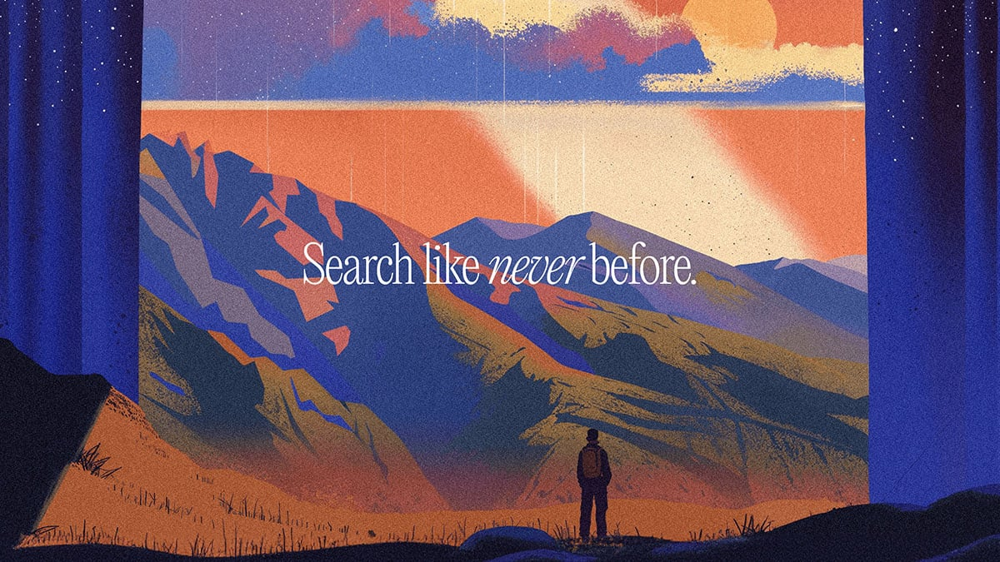

# Perplexity Aesthetic Library

A collection of visual references and JSON profiles for creating Perplexity-style illustrations.

## 001 - Publishers Program

- **Profile**: [001-publishers-program.json](profiles/001-publishers-program.json)
- **Key Elements**: Purple spheres, wildflowers, group journey, sunset gradient
- **Color Palette**: #6A0DAD (purple), #FCA311 (amber), #FF69B4 (pink)
- **Use Case**: Community, collaboration, shared discovery

## 002 - Where Knowledge Begins

- **Profile**: [002-Where-Knowledge-Begins.json](profiles/002-Where-Knowledge-Begins.json)
- **Key Elements**: Cosmic flow, Earth, ethereal lighting, flowing ribbons
- **Color Palette**: Deep space blacks, cosmic blues, warm accent ribbons
- **Use Case**: Cosmic scale, infinite possibility, knowledge as universal

## 003 - Reading Book

- **Profile**: [003-reading-book.json](profiles/003-reading-book.json)
- **Key Elements**: Open book, stars/light emanating, minimal cosmic design
- **Color Palette**: Deep navy, bright blues, white light accents
- **Use Case**: Knowledge illumination, learning, discovery moments

## 004 - Face Earth Plants

- **Profile**: [004-face-earth-plants.json](profiles/004-face-earth-plants.json)
- **Key Elements**: Profile silhouette, Earth integration, organic/nature blend
- **Color Palette**: Sunset oranges, deep purples, earth tones
- **Use Case**: Human-nature connection, consciousness, holistic thinking

## 005 - Mountain Landscape

- **Profile**: [005-Mountain-Landscape.json](profiles/005-Mountain-Landscape.json)
- **Key Elements**: Layered mountains, gradient sky, lone figure, atmospheric depth
- **Color Palette**: Peach to purple gradient, blue mountain layers
- **Use Case**: Journey, perspective, individual path, contemplation

## 006 - Search Like Never Before

- **Profile**: [006-Search-Like-Never-Before.json](profiles/006-Search-Like-Never-Before.json)
- **Key Elements**: Window/portal view, mountain vista, contemplative figure
- **Color Palette**: Warm sunset tones, cool mountain blues, high contrast
- **Use Case**: New perspectives, breakthrough moments, vision

## How to Use This Library
1. Choose a profile that matches your intended mood/message
2. Copy the JSON profile as your base
3. Modify specific elements while maintaining the core aesthetic
4. Reference this repo in AI image generation: "Use profile 003 from https://github.com/mrchopme/Perplexity-Aesthetic-Library"
